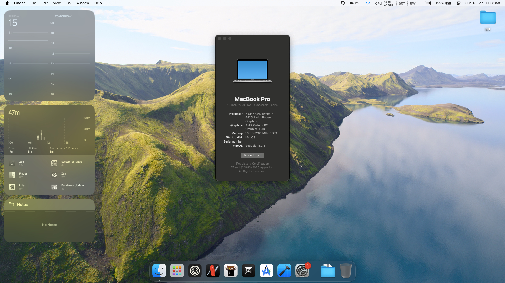

# Hackintosh: OpenCore EFI for HP Pavilion 15-eh2xxx Laptop

  

## Table of Contents

*   [Specifications](#specifications)
*   [What Works](#what-works)
*   [What Doesn't Work](#what-doesnt-work)
*   [Bios Options](#bios-options)
*   [Kexts Used](#kexts-used)
*   [SSDTs Used](#ssdts-used)
*   [Credits](#credits)

## Specifications
| **Component** | **Model** |
| ------------- | --------- |
| CPU | AMD Ryzen™ 7 5825U (8 cores, 16 threads) |
| RAM | 16GB DDR4-3200 MHz |
| iGPU | AMD Radeon™ Graphics (Barcelo/Vega) |
| Display | 15.6" FHD (1920 x 1080), IPS, 60Hz |
| NVMe | Intel SSDPEKNU010TZH 1TB |
| Audio | Realtek (AppleALC layout-id 13) |
| Wireless | Realtek RTL8852BE (PCIe - Unsupported) / Realtek RTL8812AU (USB - Supported via RtWlanU) |
| Bluetooth | Realtek [0bda:b85c] (Unsupported) |

## What Works
| Item | Status | Notes |
| --- | --- | --- |
| CPU | ✅ | AMD Vanilla Kernel Patches (8 Core config) |
| iGPU | ✅⚠️ | Hardware acceleration via NootedRed. Some minor glitches possible. **Note:** Memoji avatars can cause significant lag during rendering (e.g., on the lockscreen) |
| Screen brightness | ✅ | Native brightness control supported via SSDT-PNLF |
| Fn Keys | ✅ | Supported via BrightnessKeys.kext |
| USB | ✅ | Mapped via USBToolBox & UTBMap |
| Keyboard | ✅ | VoodooPS2Controller |
| Audio | ✅ | AppleALC with layout-id 13 |
| Microphone | ✅ | Supported via [AMDMicrophone](https://github.com/qhuyduong/AMDMicrophone) |
| Trackpad | ✅ | VoodooI2C (I2C HID mode) |
| Webcam | ✅ | Native support (UVC) |
| WIFI | ✅ | USB WLAN (RTL8812AU) supported via RtWlanU |
| Battery | ✅ | SMCBatteryManager & ECEnabler |
| Shutdown/Reboot | ✅ | No issues |
| Sleep/Wake up | ✅ | Working (See [BIOS Options](#bios-options)) |

### OpenCore version: [1.0.6](https://github.com/acidanthera/opencorepkg/releases)

### Tested macOS versions
 - Sequoia (15.x)
 
## What Doesn't Work
| Item | Status | Notes |
| --- | --- | --- |
| Bluetooth | ❌ | Realtek Bluetooth is not supported |
| Fingerprint Reader | ❌ | No macOS support for Elan/Goodix sensors |
| PCIe WiFi | ❌ | RTL8852BE is not supported. Use USB WiFi or replace card |

***
> **You CAN NOT use SMBIOS from this repository, it MUST be unique for every macOS installation**
***

## BIOS Options
*   Turn off `Secure Boot`
*	Increase VRAM to 1GB (via UMAF)
*	Enable `Above 4G decoding` (Available in UMAF)
*	Enable `Re-Size BAR support` (Available in UMAF)
    *   **Note:** If Re-Size BAR is enabled, you MUST:
        *   Remove `npci=0x3000` from your `boot-args` in `Config.plist`.
        *   Set `Booter -> Quirks -> ResizeAppleGpuBars` to `0`.
        *   Set `UEFI -> Quirks -> ResizeGpuBars` to `0`.
*   Fix Sleep: Set `S3/Modern Standby Support` to `S3 enable` (Available in UMAF)
 
> [!WARNING]
> Updating EFI may require clearing NVRAM to take full effect

## Kexts Used

| Kext | Description |
| --- | --- |
| [Lilu.kext](https://github.com/acidanthera/Lilu) | Patch engine needed for most other kexts |
| [VirtualSMC.kext](https://github.com/acidanthera/VirtualSMC) | SMC emulator |
| [NootedRed.kext](https://github.com/ChefKissInc/NootedRed) | AMD Vega/Raven/Renoir/Cezanne/Barcelo iGPU support |
| [ECEnabler.kext](https://github.com/1Revenger1/ECEnabler) | Allows battery status on many laptops |
| [BrightnessKeys.kext](https://github.com/acidanthera/BrightnessKeys) | Handler for brightness keys |
| [SMCBatteryManager.kext](https://github.com/acidanthera/VirtualSMC) | Battery monitoring |
| [AMDRyzenCPUPowerManagement.kext](https://github.com/trulyspinach/SMCAMDProcessor) | Power management for AMD CPUs |
| [SMCAMDProcessor.kext](https://github.com/trulyspinach/SMCAMDProcessor) | Sensor plugin for AMD CPU monitoring |
| [AppleALC.kext](https://github.com/acidanthera/AppleALC) | Audio patching |
| [AMDMicrophone.kext](https://github.com/qhuyduong/AMDMicrophone) | Digital Microphone support for AMD |
| [USBToolBox.kext](https://github.com/USBToolBox/kext) | USB mapping framework (Generated via [USBMap](https://github.com/corpnewt/USBMap)) |
| [UTBMap.kext](https://github.com/USBToolBox/kext) | Custom USB map for this specific device (Generated via [USBMap](https://github.com/corpnewt/USBMap)) |
| [VoodooPS2Controller.kext](https://github.com/acidanthera/VoodooPS2) | PS/2 Keyboard/Mouse support |
| [VoodooI2C.kext](https://github.com/VoodooI2C/VoodooI2C) | I2C bus support for Trackpad |
| [VoodooI2CHID.kext](https://github.com/VoodooI2C/VoodooI2C) | I2C HID device support |
| [NullEthernet.kext](https://github.com/RehabMan/OS-X-NullEthernet) | Spoofs an Ethernet device for iServices |
| [HoRNDIS.kext](https://joshuawise.com/horndis) | USB Tethering support |
| [RestrictEvents.kext](https://github.com/acidanthera/RestrictEvents) | Patches for various system features |
| [RtWlanU.kext & RtWlanU1827.kext](https://github.com/chris1111/Wireless-USB-Adapter-Clover) | Support for Realtek USB WiFi adapters |

## SSDTs Used

| SSDT | Description |
| --- | --- |
| SSDT-USBX.aml | USB Power management (Generated via [SSDTTime](https://github.com/corpnewt/SSDTTime)) |
| SSDT-RTCAWAC.aml | Fixes RTC issues on newer platforms (Generated via [SSDTTime](https://github.com/corpnewt/SSDTTime)) |
| SSDT-PLUG-ALT.aml | Fixes CPU power management definitions for newer AMD CPUs (Generated via [SSDTTime](https://github.com/corpnewt/SSDTTime)) |
| SSDT-EC.aml | Fake Embedded Controller (Generated via [SSDTTime](https://github.com/corpnewt/SSDTTime)) |
| SSDT-XOSI.aml | Spoofs Windows to enable various ACPI features (Generated via [SSDTTime](https://github.com/corpnewt/SSDTTime)) |
| SSDT-PNLF.aml | Backlight support for laptop screens |
| SSDT-RMNE.aml | Used with NullEthernet.kext |

## Credits
* [Dortania's OpenCore Install Guide](https://dortania.github.io/OpenCore-Install-Guide/)
* [ChefKiss's NootedRed Guide](https://chefkiss.dev/guides/hackintosh/)
* [AMD-OSX Discord and Community](https://amd-osx.com/)
* [Acidanthera](https://github.com/acidanthera) for OpenCore and many kexts
